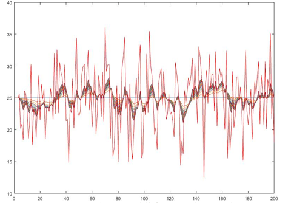

# Basic_Kalman 使用手册


## 一、使用说明


### 步骤一：头文件说明

- 包含头文件 `basic_kalman.hpp`

| 文件名                  | 文件说明                                   |
| ---------------------- | ------------------------------------------- |
| `abstract_kalman.hpp`   | 卡尔曼基类           |

### 步骤二：实例化对象

实例化对象时调用构造函数：`firstKalman();`

  
### 步骤三：函数说明

调用接口函数即可，接口函数根据数据的数量提供了两种选择：

  ```cpp
  float run(float _data);
  float mergeRun(float _data1, float _data2);
  ```

  参数解释：
  | 参数名          | 参数解释                                                           |
  | --------------- | ------------------------------------------------------------------ |
  | `_data`    | 传入滤波的数据                                      |
  | `_Q` |测量噪声               |
  | `_R`    | 过程噪声 |
  | `_t`    | 公式数据 |

## 二、自定义函数说明


### 一阶滤波器
 ```cpp
  float run(float _data);
  float mergeRun(float _data1, float _data2);
  ```

 设计思路:  
 调试过程中发现数据总会有极大的波动，导致云台会出现剧烈的抖动，因此需要一个滤波器来实现数据平滑，而卡尔曼滤波常常用在具有不确定性的动态系统中来预测系统的下一步变化，即使仍然有外界各种干扰，但卡尔曼滤波能做出最真实的预测，因此数据可以通过一阶卡尔曼滤波器变得平滑。

 
